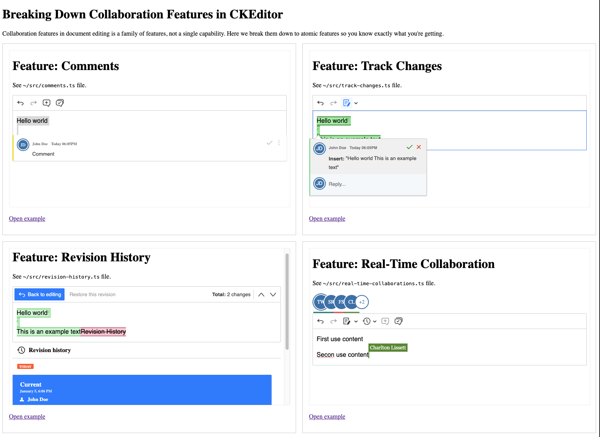

# CKEditor Collaboration features decomposed

A bare-bone Typescript demonstration project showcasing CKEditor 5's premium collaboration features in its **minimal setup**:

- [Comments ↗](https://ckeditor.com/docs/ckeditor5/latest/features/collaboration/comments/comments.html)
- [Track changes ↗](https://ckeditor.com/docs/ckeditor5/latest/features/collaboration/track-changes/track-changes.html)
- [Revision history ↗](https://ckeditor.com/docs/ckeditor5/latest/features/collaboration/revision-history/revision-history.html)
- [Real-time collaboration ↗](https://ckeditor.com/docs/ckeditor5/latest/features/collaboration/real-time-collaboration/real-time-collaboration.html)



## Prerequisites

- Node.js (LTS version recommended)
- npm

## Getting Started

1. Install dependencies:

   ```bash
   npm install
   ```

2. Create environment file:

   ```bash
   cp .env.template .env
   ```

   > This project uses CKEditor 5 premium features. A **14-day free trial** is available for evaluation:
   >
   > 👉 [Get your free trial license](https://orders.ckeditor.com/trial/premium-features) and fill the keys to `.env` file

3. Start the development server:

   ```bash
   npm run dev
   ```

4. Open your browser to [http://localhost:5173](http://localhost:5173)

## What's Included

This demo includes four separate editor examples, each in its own page under `/features/`:

- **Comments** - Inline commenting and discussion threads
- **Track Changes** - Suggestion tracking with accept/reject functionality
- **Revision History** - Document version management with side-by-side comparison
- **Real-Time Collaboration** - Live collaborative editing with all features combined

Each example is self-contained in its own TypeScript file under `src/`.

## Additional Commands

```bash
npm run build    # Build for production
npm run preview  # Preview production build
```
